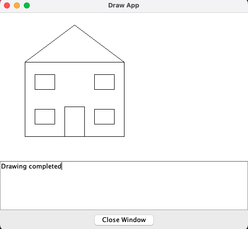
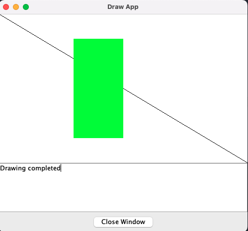

# Weekly C programming facts and exercises

<details>
<summary>Week 1</summary>
<br>

The GCC compiler names its output file `a.out` by default when no output filename is specified using the `-o` flag.

The name `a.out` stands for **assembler output**, originating from the early Unix systems developed at Bell Labs, as it was the direct result of the assembly process in the first Unix assembler on the PDP-7.

```
cd house
gcc -o house -I../graphics house.c ../graphics/graphics.c
./house | java -jar ../graphics/drawapp-4.5.jar
```



```
cd rectangle
gcc -o rectangle -I../graphics rectangle.c ../graphics/graphics.c
./rectangle | java -jar ../graphics/drawapp-4.5.jar
```



</details>
